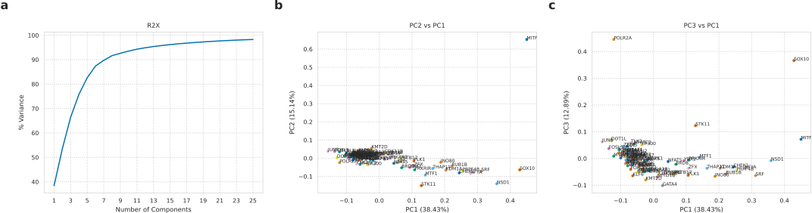
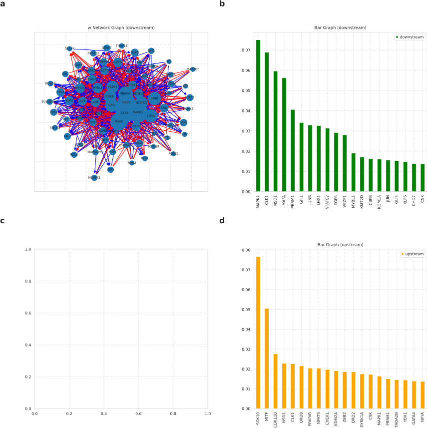
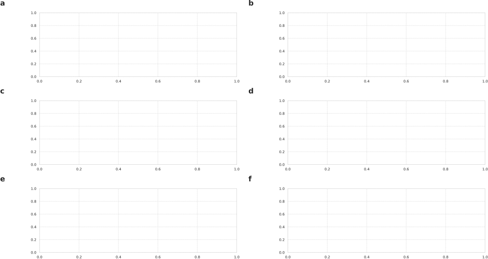

---
title: Integrating data-driven and mechanistic approaches in cell regulatory pathway analysis
keywords:
- markdown
- publishing
- manubot
lang: en-US
date-meta: '2021-01-28'
author-meta:
- Madison Wahlsten
- Zhan Zhang
- Aaron S. Meyer
header-includes: |-
  <!--
  Manubot generated metadata rendered from header-includes-template.html.
  Suggest improvements at https://github.com/manubot/manubot/blob/master/manubot/process/header-includes-template.html
  -->
  <meta name="dc.format" content="text/html" />
  <meta name="dc.title" content="Integrating data-driven and mechanistic approaches in cell regulatory pathway analysis" />
  <meta name="citation_title" content="Integrating data-driven and mechanistic approaches in cell regulatory pathway analysis" />
  <meta property="og:title" content="Integrating data-driven and mechanistic approaches in cell regulatory pathway analysis" />
  <meta property="twitter:title" content="Integrating data-driven and mechanistic approaches in cell regulatory pathway analysis" />
  <meta name="dc.date" content="2021-01-28" />
  <meta name="citation_publication_date" content="2021-01-28" />
  <meta name="dc.language" content="en-US" />
  <meta name="citation_language" content="en-US" />
  <meta name="dc.relation.ispartof" content="Manubot" />
  <meta name="dc.publisher" content="Manubot" />
  <meta name="citation_journal_title" content="Manubot" />
  <meta name="citation_technical_report_institution" content="Manubot" />
  <meta name="citation_author" content="Madison Wahlsten" />
  <meta name="citation_author_institution" content="Department of Biomedical Engineering, University of Michigan, Ann Arbor" />
  <meta name="citation_author_orcid" content="0000-0002-3435-9260" />
  <meta name="citation_author" content="Zhan Zhang" />
  <meta name="citation_author_institution" content="Department of Biology, Southern University of Science and Technology" />
  <meta name="citation_author_orcid" content="0000-0003-2767-7524" />
  <meta name="citation_author" content="Aaron S. Meyer" />
  <meta name="citation_author_institution" content="Department of Bioengineering, University of California, Los Angeles" />
  <meta name="citation_author_institution" content="Department of Bioinformatics, University of California, Los Angeles" />
  <meta name="citation_author_institution" content="Jonsson Comprehensive Cancer Center, University of California, Los Angeles" />
  <meta name="citation_author_institution" content="Eli and Edythe Broad Center of Regenerative Medicine and Stem Cell Research, University of California, Los Angeles" />
  <meta name="citation_author_orcid" content="0000-0003-4513-1840" />
  <meta name="twitter:creator" content="@aarmey" />
  <link rel="canonical" href="https://meyer-lab.github.io/DE-learning/" />
  <meta property="og:url" content="https://meyer-lab.github.io/DE-learning/" />
  <meta property="twitter:url" content="https://meyer-lab.github.io/DE-learning/" />
  <meta name="citation_fulltext_html_url" content="https://meyer-lab.github.io/DE-learning/" />
  <meta name="citation_pdf_url" content="https://meyer-lab.github.io/DE-learning/manuscript.pdf" />
  <link rel="alternate" type="application/pdf" href="https://meyer-lab.github.io/DE-learning/manuscript.pdf" />
  <link rel="alternate" type="text/html" href="https://meyer-lab.github.io/DE-learning/v/75665ceee9e41514b57e49721c7e7878c4e7a9f8/" />
  <meta name="manubot_html_url_versioned" content="https://meyer-lab.github.io/DE-learning/v/75665ceee9e41514b57e49721c7e7878c4e7a9f8/" />
  <meta name="manubot_pdf_url_versioned" content="https://meyer-lab.github.io/DE-learning/v/75665ceee9e41514b57e49721c7e7878c4e7a9f8/manuscript.pdf" />
  <meta property="og:type" content="article" />
  <meta property="twitter:card" content="summary_large_image" />
  <link rel="icon" type="image/png" sizes="192x192" href="https://manubot.org/favicon-192x192.png" />
  <link rel="mask-icon" href="https://manubot.org/safari-pinned-tab.svg" color="#ad1457" />
  <meta name="theme-color" content="#ad1457" />
  <!-- end Manubot generated metadata -->
bibliography: []
manubot-output-bibliography: output/references.json
manubot-output-citekeys: output/citations.tsv
manubot-requests-cache-path: cache/requests-cache
manubot-clear-requests-cache: false
...

<small><em>
This manuscript
([permalink](https://meyer-lab.github.io/DE-learning/v/75665ceee9e41514b57e49721c7e7878c4e7a9f8/))
was automatically generated
from [meyer-lab/DE-learning@75665ce](https://github.com/meyer-lab/DE-learning/tree/75665ceee9e41514b57e49721c7e7878c4e7a9f8)
on January 28, 2021.
</em></small>

## Authors

+ **Madison Wahlsten** 
    ORCID
    [0000-0002-3435-9260](https://orcid.org/0000-0002-3435-9260)
    · Github
    [mlwahl](https://github.com/mlwahl) 
  <small>
     Department of Biomedical Engineering, University of Michigan, Ann Arbor
  </small>

+ **Zhan Zhang** 
    ORCID
    [0000-0003-2767-7524](https://orcid.org/0000-0003-2767-7524)
    · Github
    [Zhanzhang-2020](https://github.com/Zhanzhang-2020) 
  <small>
     Department of Biology, Southern University of Science and Technology
  </small>

+ **Aaron S. Meyer** 
    ORCID
    [0000-0003-4513-1840](https://orcid.org/0000-0003-4513-1840)
    · Github
    [aarmey](https://github.com/aarmey)
    · twitter
    [aarmey](https://twitter.com/aarmey) 
  <small>
     Department of Bioengineering, University of California, Los Angeles; Department of Bioinformatics, University of California, Los Angeles; Jonsson Comprehensive Cancer Center, University of California, Los Angeles; Eli and Edythe Broad Center of Regenerative Medicine and Stem Cell Research, University of California, Los Angeles
  </small>

## Abstract {.page_break_before}

Though effective therapies exist for melanoma, resistance to these drugs inevitably develops. Previous studies have shown that resistance arises from rare cancer cells that are reprogrammed from a pre-resistant state. Several genes, including EGFR, NGFR, and AXL, are disproportionately expressed in pre-resistant cells and have been comprehensively profiled through knockout models and gene expression measurement. However, the broader regulatory events by which a cell enters this rare state are unclear. A unified model for how these components interact would help uncover drivers of this process. We built an ordinary differential equation model of the concentrations of mRNA corresponding to pre-resistant genes. We used this as a data-driven framework to identify gene-gene interactions by allowing all possible interactions, then comparing to gene expression measurements from each knockout using optimization implemented in Julia. The interaction parameters inferred by the model can be used to identify key regulators driving melanoma drug resistance development.

## Introduction

Whether exploring variation at the single cell, tissue, or population level, a key challenge is separating molecular driver from passenger effects. Drivers may be defined as molecular factors that are necessary to observe the variation; this causal role can be important as these factors can be manipulated and further studied to understand the sources of this variation. By contrast, passenger effects are the consequences of the variation in upstream drivers. While passengers may be important for further molecular variation, or phenotypic consequences of molecular variation, this is not ensured by their variation itself. In many cases disruption of passenger factors has little or no effect.

A variety of strategies have been employed to explore and attempt to identify the drivers of molecular variation in biological systems. The simplest and most widespread is perhaps gene set enrichment analysis, wherein prior knowledge is used to assemble groups of genes or other molecular factors that are known to be affected by some upstream driver [@PMID:16199517]. A high degree of overlap is then taken as evidence implicating that driver in the observed process. Prior knowledge in the form of graphs for gene-gene effects can be used, with or without graph-based enrichment approaches. For simply exploring variation, dimensionality reduction schemes, such as principal components analysis, t-SNE, or UMAP can help to organize variation into simplified patterns across the data.

Some consistent challenges exist in each of the existing methods for exploring variation. First, those that are reliant on prior knowledge-defined molecular networks or gene sets necessarily suffer from incomplete and biased coverage. While analysis based solely on the measurements at hand prevents prior knowledge bias, observational measurements without defined interventions are insufficient to determine the directionality of molecular networks. It is also not possible to disentangle the contributory factors to gene-gene correlation strengths from observational measurements. For example, two genes might be highly correlated due to strong regulatory influence, one overwhelming source of variation relative to others, or the strong influence of a common upstream regulator. The common solution to each of these problems is a reliable, directed, quantitative estimate of gene-gene influences.

We begin by extending recent work using data-driven dynamical systems as an interpretable model in perturbation biology experiments [@PMID:32667922; @DOI:10.1016/j.cels.2020.11.013]. We identify that, in the absence of dynamic measurements, this type of model can be simplified into its steady-state limit, and then further into an iterative expectation-maximization matrix solving framework. This extension allows us to scale this interpretable model to genome-scale perturbation measurements and solve for the solution graph of gene-gene, signed and directed interaction effects. While perturbation effects are context dependent between cell lines, we show that a common network of gene-gene effects can be derived. Finally, we use this resulting graph to trace molecular variation through the interaction effect network. We anticipate this variance flux analysis approach will be helpful for identifying the drivers of variation in biological systems. 

## Results

### Scaling up an interpretable perturbation biology model to genome scales

A variety of computational methods have been developed to infer cellular networks from molecular profiling efforts. Most often these have been descriptive statistical models, such as co-expression networks or mutual information methods, which identify network connections but cannot make specific predictions for the effect of certain perturbations. 

Given these limitations, we applied a recently-proposed approach, in which a non-linear system of ordinary differential equations is fit to a panel of molecular intervention and profiling experiments. By doing so, the model is both able to predict the effect of new interventions alone or in combination and reconstructs a network of interactions among individual molecular nodes.

While a variety of techniques exist to improve the scalability of ODE models, we found that the CellBox approach was still limiting at genome scales. Briefly, each iteration requires both initial solving and sensitivity calculations for each perturbation applied. One model solution includes a number of dimensions equal to the number of molecular nodes within the model, and the number of parameters scales with the square of the number of species. Because of the parameter scaling, careful selection of regularization will be necessary for larger models as they in general will be underdetermined without these constraints. Finally, the fitting process requires many iterations which increases with the number of unknown parameters, and local minima are sure to hinder gradient-based optimization.

As a result of these limitations, we explored alternative approaches to fitting such a model. We were interested in exploring the XXX, wherein 1000 genes were each knocked down by siRNA or CRISPR, and then the expression of all 1000 genes was profiled. As a result, we were left with 1,000,000 training points for capturing the effect of gene-gene interactions. As in earlier work, we had only a single snapshot measurement, and so assumed that our measurements were made at steady-state. Thus, our first simplification was to dispel with ODE solving and consider the deviation of our differential equations from steady-state as our fitting cost function. This also allowed us to recognize that all our perturbations could be expressed as a single matrix equation for "fused" solving.

Expressing the steady-state CellBox model as a single matrix equation then revealed an iterative solving routine we could apply for more efficient fitting. In other fitting models with multiple unknowns, such as non-negative matrix factorization or tensor factorization, one can alternate between solving for the best-fit value of each unknown. We applied this by calculating the best-fit $\epsilon$, then using the least-squares solution of the interaction matrix $W$, and alternating between these steps until convergence. Importantly, this iterative scheme, we term FactorBox, still allows for various regularization such as orthogonality, sparsity, and other forms.

![Schematic of our approach. (A) We started with a generic dynamical model in which every gene is connected by potentially positive or negative interaction effects. These interaction effects are saturable through a non-linear link function. (B) Using a steady-state assumption, we simplified the model to fit the differential equations directly using the rates of change as our cost function. This also allowed us to structure the differential equations in matrix form. (C) Recognizing that the two unknowns, the $W$ matrix and $\epsilon$ vector, can be identified through direct solving schemes, we setup an iterative fitting scheme.](figure1.svg){#fig:quantFig width="100%"}

### FactorBox reduces cellular context-dependent effects

With a working scalable model of gene-gene interaction effects, we wished to determine whether FactorBox identified consistent results that were independent of cellular context. To do so, we fit the model to the same knockout and profiling experiments performed in a series of different cell lines. We then quantified the difference in the inferred gene-gene interaction network between each cell line. As a baseline of comparison, we used the gene loadings matrix from principal components analysis of the same experiment. We observed strong concordance in the inferred interaction effects and greater agreement across cell lines in the FactorBox model as compared to the PCA loadings. This indicates that the baseline expression and therefore the consequent gene expression patterns are different between cell lines, but the individual interaction effects are shared.

With this in mind, we devised a modified scheme to fit the gene-gene interaction effects taking into account all of the cell lines together. By doing so, we enforced that all cell line responses should be explained by a common set of gene-gene interactions. Despite adding ~8,000,000 measurements and only ~8,000 new parameters, the model fits were of equal quality to those obtained with each cell line separately. This suggests that a common gene-gene interaction network can be obtained, and cell line context differences can be explained through non-linearity introduced through baseline expression differences. (For example, if a gene is not expressed, pathway activity will be distinguished at that point.)

{#fig:fig2 width="100%"}

### FactorBox provides a de novo, quantitative, directed graph of gene-gene effects

With the confidence that FactorBox provides a reliable network of gene-gene interaction effects, we sought some preliminary exploration of the inferred network. Gene interactions formed a scale-free network, with extremes of highly connected and isolated nodes. Importantly, the perturbation data makes it possible to identify loops of interactions, and we observed quite a few positive and negative feedback loops across the graph. As just one example...

{#fig:fig3 width="100%"}

### Variance flux analysis identifies the drivers of cell-to-cell variation

Compare the eigenvectors of the graph to the eigenvectors of the covariance matrix.

{#fig:fig4 width="100%"}

## Discussion

## Methods

### PageRank node characterization

### Perturbation model

The model was constructed using Julia 1.5.0. The levels of mRNA in response to different perturbations are described by a unified system of ordinary differential equations. In this equation, $x_{i}^\mu$ represents the expression level of each gene under a specific knockout condition $\mu$. $\omega$ is a matrix representing interactions between different genes, specifically, $\omega_{ij}$ indicate interaction between gene j on gene i. To simulate the knockout condition, the corresponding column in $\omega$ is set to 0. All the elements in $\omega$ are also assumed to be constant after the introduction of a specific perturbation. We use function $\mathit{1 + tanh( )}$ to model the saturation effect of the interaction term and avoid negative values. Then $\epsilon$ is used as a saturation coefficient to bound the whole interaction term. Finally, we use $\alpha$ to characterize the degradation rate of each mRNA. The initial values of state variables x are approximated by $\mathit{\epsilon / \alpha}$, derived from steady-state assumption of the ODE equation while ignoring the effect of the $\omega$ matrix. The ODE system was numerically solved using the AutoVern7 method with low tolerance. In addition, the Jacobian matrix of the ODE equation was symbolically calculated and provided to the ODE solver for performance. The model performance was evaluated by difference between RNA-Seq Data and simulation output (the comparison was also visualized by using scatterplot of Model outputs vs RNA-Seq Measurements).

### Fused perturbation solving

By assuming that every treatment should be at steady-state, the fitting process can do away with the ODE solver. In other words, after initialization, the parameters can be optimized by minimizing a cost function that calculate the norm of deviation from steady-state values, ensuring the output of model is consistent with experiment data. And to improve the performance of optimization, all the knockout conditions are solved with matrix math:

$$cost = norm(\epsilon \cdot (1 + tanh(\omega\cdot U)) - \alpha\cdot D)$$

D is an 83 x 84 experiment data matrix while U is a copy of D. Instead of modifying w matrix, the diagonal elements in U matrix are set to zero in order to simulate each knockout condition. As a result, this allows to solve the model in a single pass:

$$U[diagind(U)] =0$$

### Iterative matrix solving method

As described above, all the perturbations can be described at steady state by solving the matrix equation:

$$\bar{\epsilon} \left( 1 + \tanh⁡\left(W U \right) \right) = \alpha X$$

Given steady-state measurements, $\alpha$ cannot be identified separately from $\bar{\epsilon}$ and so we set the value of the former to 0.1. This leaves two co-dependent unknowns $\bar{\epsilon}$ and W to be determined. However, given some specified value of W, $\bar{\epsilon}$ can be found using the geometric mean of each column from the ratio of $\alpha X$ and $1 + \tanh(WU)$. We additionally limited the minimum value of both expressions to be 0.1, to avoid issues arising from genes with no expression. Conversely, with fixed $\bar{\epsilon}$ one can solve for W using the expression:

$$B = \tanh^{-1}⁡(αX/\bar{\epsilon} - 1)$$

$$W = ( {U'}^{*}  B' )'$$

Where ${U'}^{*}$ indicates the pseudoinverse of $U’$. The values were restricted to the domain -0.9 to 0.9 before atanh transformation to reduce the effect of outlier values. Consequently, one can iteratively solve for the overall solution by repeated and alternating solving for each variable. We found this to generally converge within 10 iterations.

Conveniently, this approach can also account for various regularization for the structure of $W$, including orthogonality and sparsity, through generalizations of the pseudoinverse [@DOI:10.1137/15M1028479; @DOI:10.1137/0119015]. In any practical situation the pseudoinverse is also the predominant cost for solving and is sure to be far less costly than generic optimization with or without solving the ordinary differential equations.

## References {.page_break_before}

<!-- Explicitly insert bibliography here -->

